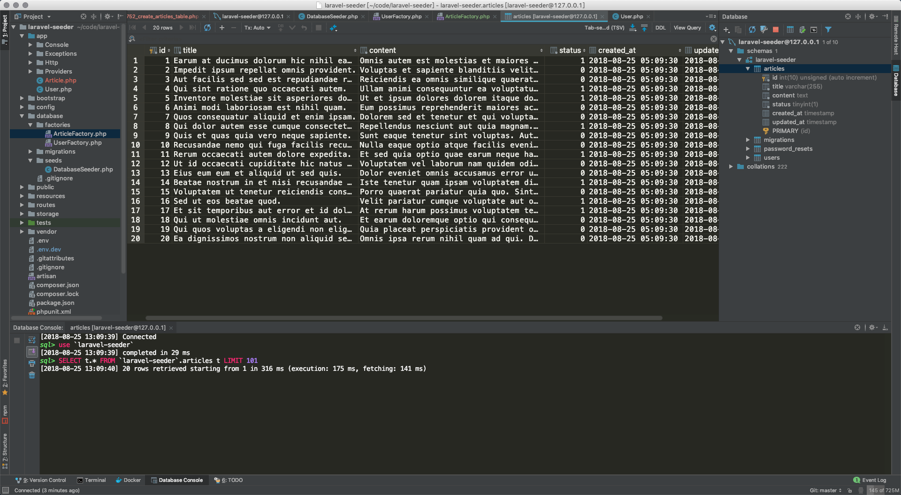
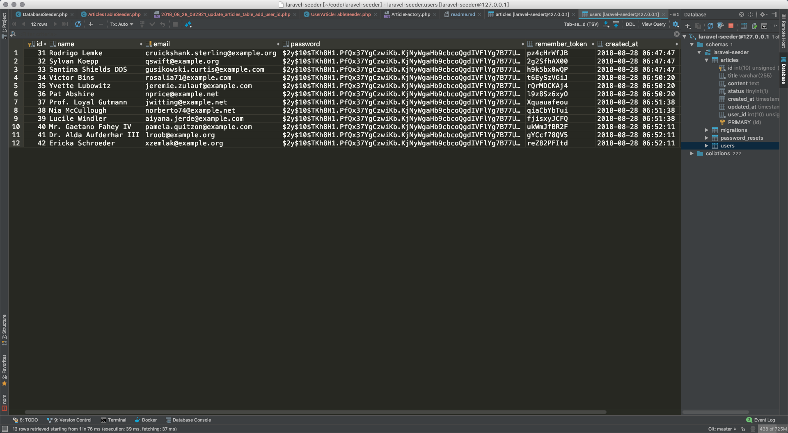
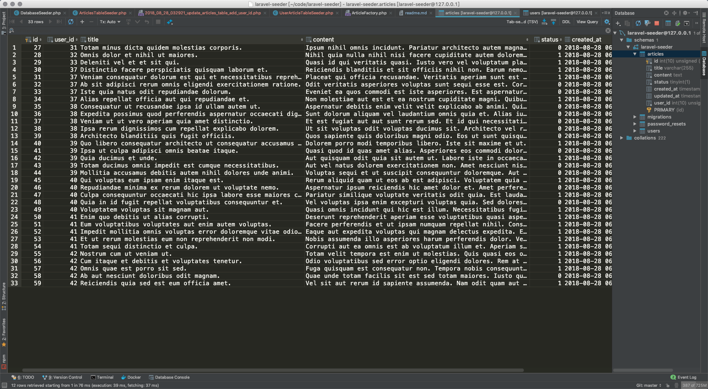

# Laravel 数据填充

## 创建表

### 使用 `migrate` 生成表的迁移文件.

`php artisan make:migration create_articles_table --create=articles`

```shell
➜  laravel-seeder git:(master) ✗ php artisan make:migration create_articles_table --create=articles
Created Migration: 2018_08_25_042752_create_articles_table
➜  laravel-seeder git:(master) ✗
```


### 设计表

编辑刚刚生成的迁移文件. 添加字段 `title`, `content`, `status` 字段.

```php
<?php

use Illuminate\Support\Facades\Schema;
use Illuminate\Database\Schema\Blueprint;
use Illuminate\Database\Migrations\Migration;

class CreateArticlesTable extends Migration
{
    /**
     * Run the migrations.
     *
     * @return void
     */
    public function up()
    {
        Schema::create('articles', function (Blueprint $table) {
            $table->increments('id');
            $table->string('title', 255)->comment('标题');
            $table->text('content')->comment('内容');
            $table->boolean('status')->comment('状态, 1: 显示, 0: 不显示');
            $table->timestamps();
        });
    }

    /**
     * Reverse the migrations.
     *
     * @return void
     */
    public function down()
    {
        Schema::dropIfExists('articles');
    }
}

```

### 生成表

`php artisan migrate`

```shell
root@5c9598078ab8:/var/www/laravel-seeder# php artisan migrate
Migration table created successfully.
Migrating: 2014_10_12_000000_create_users_table
Migrated:  2014_10_12_000000_create_users_table
Migrating: 2014_10_12_100000_create_password_resets_table
Migrated:  2014_10_12_100000_create_password_resets_table
Migrating: 2018_08_25_042752_create_articles_table
Migrated:  2018_08_25_042752_create_articles_table
root@5c9598078ab8:/var/www/laravel-seeder#
```


## 生成 Model

`php artisan make:model Article`

```shell
root@5c9598078ab8:/var/www/laravel-seeder# php artisan make:model Article
Model created successfully.
root@5c9598078ab8:/var/www/laravel-seeder#
```


## 设置虚拟数据

在 `database/factories` 目录下新建文件. 

`ArticleFactory.php`

```php
<?php

use Faker\Generator as Faker;

/*
|--------------------------------------------------------------------------
| Model Factories
|--------------------------------------------------------------------------
|
| This directory should contain each of the model factory definitions for
| your application. Factories provide a convenient way to generate new
| model instances for testing / seeding your application's database.
|
*/

$factory->define(App\Article::class, function (Faker $faker) {
    return [
        'title' => $faker->sentence,
        'content' => $faker->paragraph,
        'status' => $faker->boolean(),
    ];
});

```

## 生成虚拟数据

在命令行下. 执行 `php artisan tinker`

先声明命名空间.

`namespace App;`

再创建 20 条数据. 

`factory(Article::class, 20)->create();`

```shell
root@5c9598078ab8:/var/www/laravel-seeder# php artisan tinker
Psy Shell v0.9.6 (PHP 7.2.4-1+ubuntu16.04.1+deb.sury.org+1 — cli) by Justin Hileman
>>> namespace App;
>>> factory(Article::class, 20)->create();
=> Illuminate\Database\Eloquent\Collection {#2874
     all: [
       App\Article {#2870
         title: "Earum at ducimus dolorum hic nihil ea dolorem.",
         content: "Omnis autem est molestias et maiores deserunt sint. Eos iusto sit voluptatem. Cupiditate omnis voluptas maxime quas molestiae culpa nesciunt.",
         status: true,
         updated_at: "2018-08-25 05:09:30",
         created_at: "2018-08-25 05:09:30",
         id: 1,
       },
       App\Article {#2868
         title: "Impedit ipsum repellat omnis provident.",
         content: "Voluptas et sapiente blanditiis velit. Perferendis omnis impedit voluptatum deserunt error. Vitae consequatur ex ipsa vitae. Qui quia illum rerum delectus nemo omnis.",
         status: false,
         updated_at: "2018-08-25 05:09:30",
         created_at: "2018-08-25 05:09:30",
         id: 2,
       },
       // 省略...
     ],
   }
>>>
```

查看数据库, 数据已经生成了. 





# 关联表的数据生成

给 articles 表添加字段 user_id

```shell
root@5c9598078ab8:/var/www/laravel-seeder# php artisan make:migration update_articles_table_add_user_id --table=articles
Created Migration: 2018_08_28_032921_update_articles_table_add_user_id
root@5c9598078ab8:/var/www/laravel-seeder#
```

```php
<?php

use Illuminate\Support\Facades\Schema;
use Illuminate\Database\Schema\Blueprint;
use Illuminate\Database\Migrations\Migration;

class UpdateArticlesTableAddUserId extends Migration
{
    /**
     * Run the migrations.
     *
     * @return void
     */
    public function up()
    {
        Schema::table('articles', function (Blueprint $table) {
            $table->unsignedInteger('user_id');
        });
    }

    /**
     * Reverse the migrations.
     *
     * @return void
     */
    public function down()
    {
        Schema::table('articles', function (Blueprint $table) {
            $table->dropColumn('user_id');
        });
    }
}

```


```shell
root@5c9598078ab8:/var/www/laravel-seeder# php artisan migrate
Migrating: 2018_08_28_032921_update_articles_table_add_user_id
Migrated:  2018_08_28_032921_update_articles_table_add_user_id
root@5c9598078ab8:/var/www/laravel-seeder#
```

设置模型关联.


```php
<?php

namespace App;

use Illuminate\Notifications\Notifiable;
use Illuminate\Foundation\Auth\User as Authenticatable;
use App\Article;

class User extends Authenticatable
{
    use Notifiable;

    /**
     * The attributes that are mass assignable.
     *
     * @var array
     */
    protected $fillable = [
        'name', 'email', 'password',
    ];

    /**
     * The attributes that should be hidden for arrays.
     *
     * @var array
     */
    protected $hidden = [
        'password', 'remember_token',
    ];

    /**
     * 模型关联.
     * @return \Illuminate\Database\Eloquent\Relations\HasMany
     */
    public function hasManyArticles()
    {
        return $this->hasMany(Article::class, 'user_id', 'id');
    }
}

```


生成 seeder 文件

`php artisan make:seeder UserArticleTableSeeder`


```php
<?php

use Illuminate\Database\Seeder;
use App\User;
use App\Article;

class UserArticleTableSeeder extends Seeder
{
    /**
     * Run the database seeds.
     *
     * @return void
     */
    public function run()
    {
        factory(User::class, 3)
            ->create()
            ->each(function (User $user) {
                collect(range(1, 5))->each(function () use ($user) {
                    $user->hasManyArticles()->save(factory(Article::class)->make());
                });
            });
    }
}

```

运行 seeder, 生成数据

`php artisan db:seed --class=UserArticleTableSeeder`








另一个例子. https://laravel-china.org/topics/15077/what-is-the-n1-problem-and-how-to-solve-the-n1-problem-in-laravel

